## Các widget thông dụng

| UI                                                                      | Class                       | Note |
|-------------------------------------------------------------------------|-----------------------------|------|
| 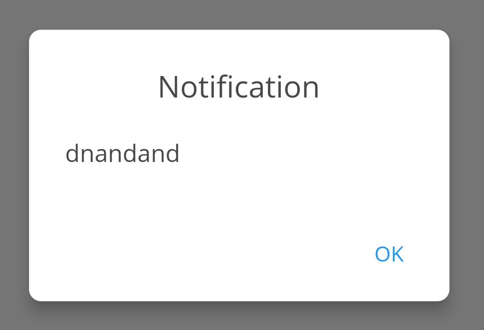                            | DialogUtil.alert            |      |
| 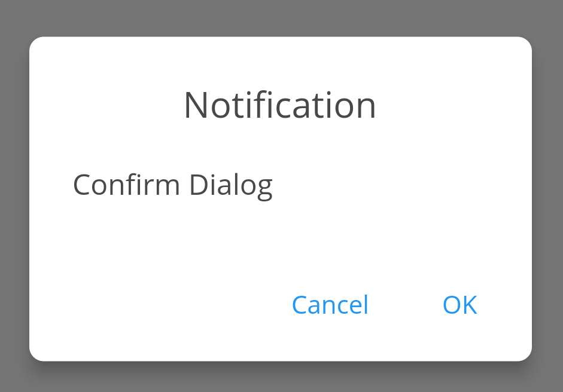                         | DialogUtil.confirm          |      |
| 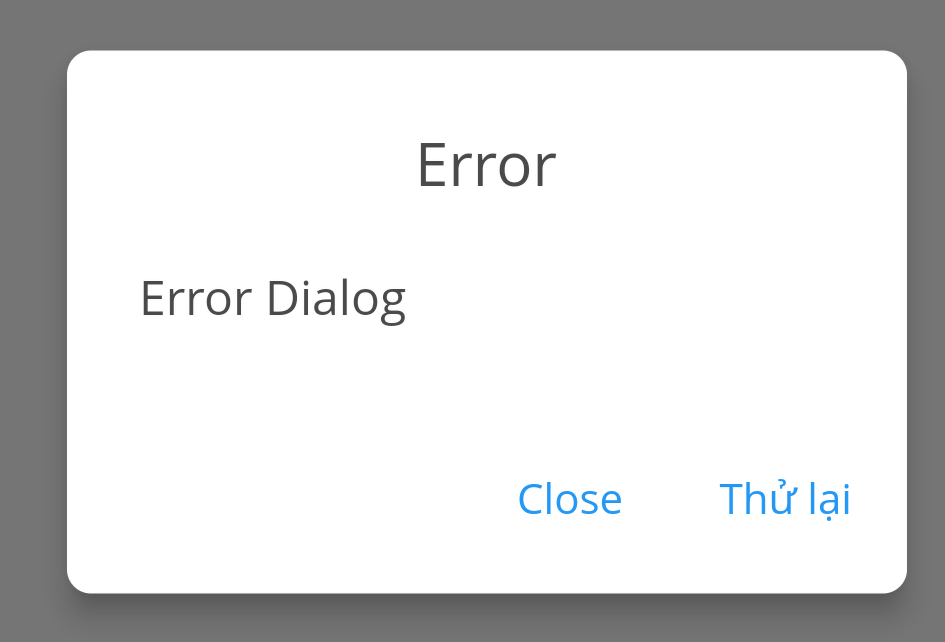                           | DialogUtil.error            |      |
| 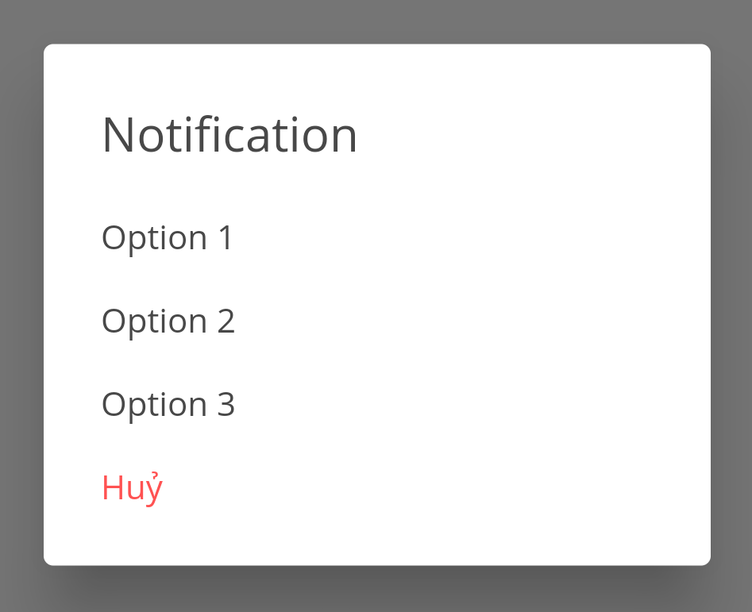                          | DialogUtil.option           |      |
| 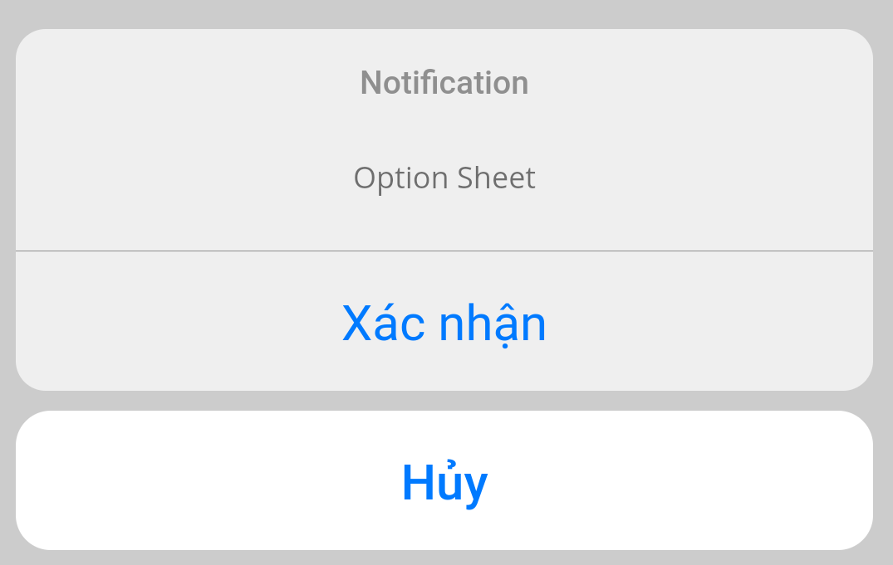                           | DialogUtil.optionSheet      |      |
|                           | BannerWidget                |      |
|                           | DotIndicator                |      |
| 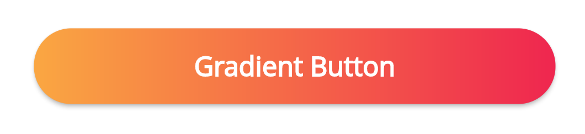                        | GradientButton              |      |
| 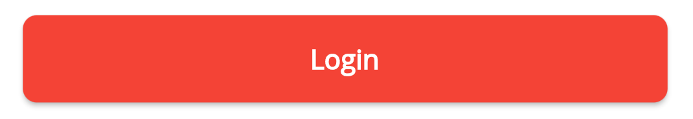                         | InkwellButton               |      |
|                           | GradientText                |      |
|                           | ImageLoading                |      |
| 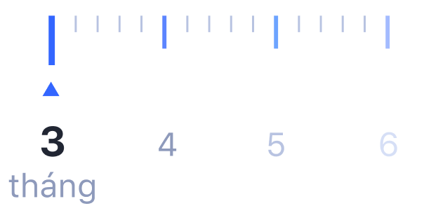                     | RulerScrollWidget           |      |
| 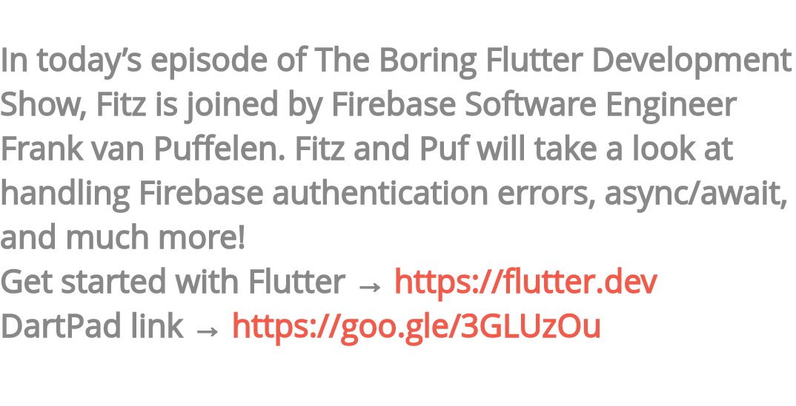                              | TextLink                    |      |
| 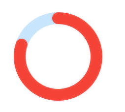                        | CircleProgress              |      |
|                | AnimationCircleProgress     |      |
| 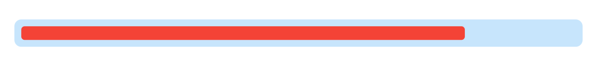                    | HorizontalProgress          |      |
| 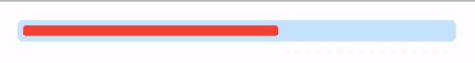           | AnimationHorizontalProgress |      |
| 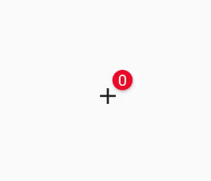                                 | Badge                       |      |
| 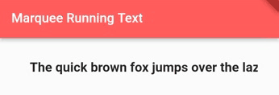                               | Marquee                     |      |
| 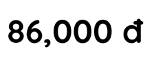                           | MoneyWidget                 |      |
|                           | TabBarWidget                |      |
|                            | TitleWidget                 |      |
|                              | BlinkText                   |      |
| 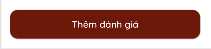                          | BottomButton                |      |
| 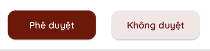                         | Bottom2Button               |      |
| 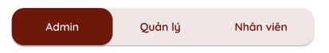                    | BubbleTabIndicator          |      |
| 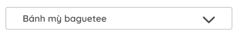                        | CommonDropDown              |      |
| 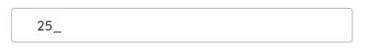                       | CommonTextField             |      |
| 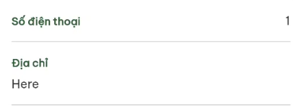                             | BaseField                   |      |