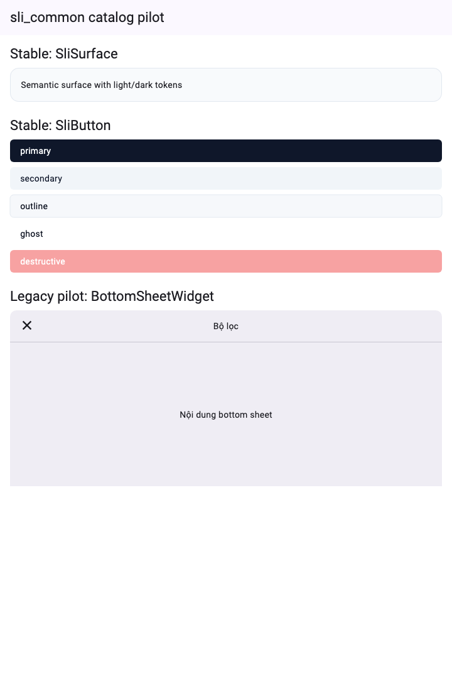

# sli_common

“Túi dụng cụ” Flutter cá nhân gồm design tokens, theme, component `Sli*` ổn
định, utilities và các widget legacy đang được chuẩn hóa dần.

> Bắt đầu tại đây: xem hình và tên API trong quick gallery, mở trang component
> để đọc cách dùng, sau đó chạy example nếu cần thử interaction thật.

## Bắt đầu nhanh

```dart
import 'package:sli_common/sli_common.dart';

MaterialApp(
  theme: SliTheme.light(),
  darkTheme: SliTheme.dark(),
  builder: (context, child) => SliShadcnScope(
    child: child ?? const SizedBox.shrink(),
  ),
);
```

Ứng dụng chỉ import public barrel `package:sli_common/sli_common.dart`. Không
import trực tiếp `shadcn_flutter`; Shadcn là implementation detail phía sau
facade `Sli*`.

## Chọn component theo trạng thái

| Trạng thái | Ý nghĩa | Quy tắc sử dụng |
|---|---|---|
| **Stable** | API `Sli*` có contract và test | Ưu tiên cho code mới |
| **Legacy** | Dùng được nhưng API/behavior chưa chuẩn hóa | Kiểm tra docs và caller trước khi dùng |
| **Experimental** | Đang thử contract | Không dùng rộng trong production |
| **Deprecated** | Có replacement rõ ràng | Không tạo caller mới |

## Quick gallery



| Nhu cầu | Public API | Trạng thái | Xem cách dùng |
|---|---|---|---|
| Button và CTA | `SliButton` | **Stable** | [SliButton](docs/catalog/sli-button.md) |
| Surface/card container | `SliSurface` | **Stable** | [SliSurface](docs/catalog/sli-surface.md) |
| Khung nội dung bottom sheet | `BottomSheetWidget` | **Legacy / candidate** | [BottomSheetWidget](docs/catalog/bottom-sheet-widget.md) |
| Dialog/sheet helpers | `DialogUtil` | Legacy | [Inventory](docs/catalog/legacy-inventory.md#feedback--overlay) |
| Input/form | `CommonTextField`, `BaseField`, `CommonDropDown` | Legacy | [Inventory](docs/catalog/legacy-inventory.md#input--form) |
| Loading/progress | `CircleProgress`, `HorizontalProgress`, `ImageLoading` | Legacy | [Inventory](docs/catalog/legacy-inventory.md#feedback--overlay) |
| Display/media | `BannerWidget`, `Badge`, `MoneyWidget`, `PhotoViewScreen` | Legacy | [Inventory](docs/catalog/legacy-inventory.md#display--media) |

Danh sách đầy đủ 45 public export và maturity status nằm tại
[catalog index](docs/catalog/README.md) và
[legacy inventory](docs/catalog/legacy-inventory.md).

## Chạy showroom

```bash
cd example
flutter pub get
flutter run
```

Showroom hiện cover foundation, button, surface và BottomSheet pilot. Catalog
sẽ mở rộng theo từng component family, không migrate hàng loạt chỉ vì trùng tên
file với app.

## Quy tắc thêm component

1. Tìm trong [catalog](docs/catalog/README.md) trước khi tạo API mới.
2. Xác định ownership: dùng chung nhiều app hay chỉ thuộc một sản phẩm.
3. Dùng [component template](docs/catalog/component-template.md).
4. Thêm story/example và widget/semantics test; thêm golden khi hình dạng quan
   trọng.
5. Export qua `lib/sli_common.dart` và cập nhật inventory trong cùng commit.
6. Chỉ gắn **Stable** khi contract, theme và accessibility đã được kiểm chứng.

## Tài liệu kỹ thuật

- [Kiến trúc package](docs/architecture.md)
- [Component contract](docs/components.md)
- [Migration guide](docs/migration.md)
- [Catalog và maturity](docs/catalog/README.md)
- [Changelog](CHANGELOG.md)

Các ảnh legacy cũ vẫn được lưu trong [`guide/`](guide/) để truy vết, nhưng catalog
mới là nơi xác định API và trạng thái hiện hành.
