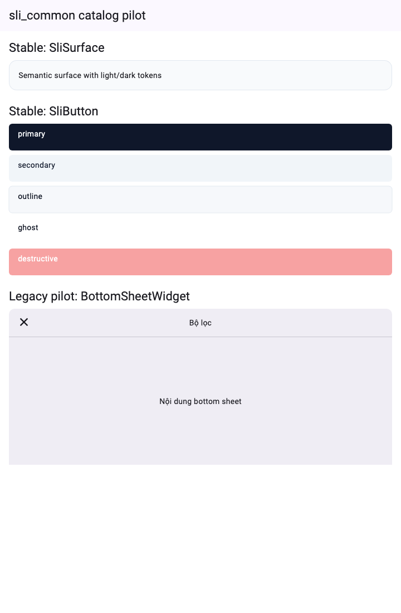
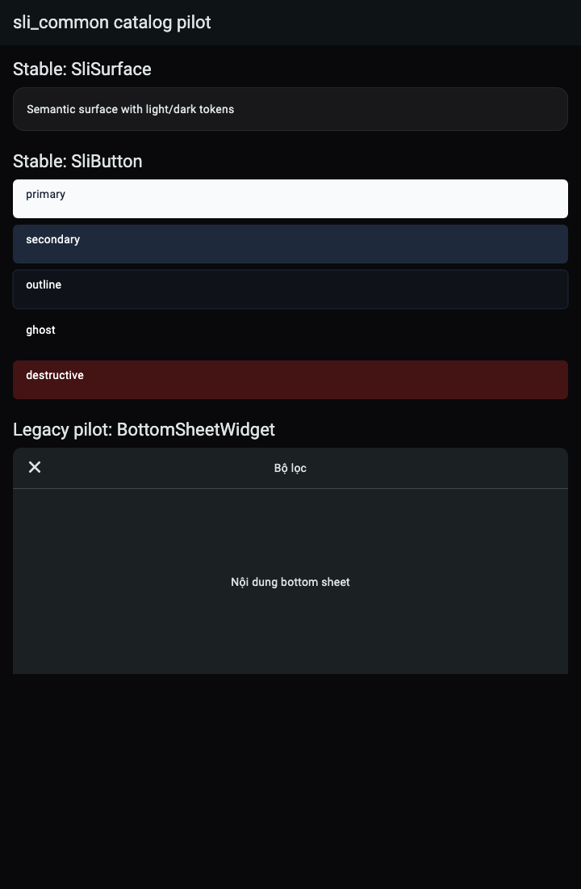

# `SliSurface`

- **Category:** Container
- **Status:** Stable
- **Public import:** `package:sli_common/sli_common.dart`
- **Source:** [`lib/src/components/sli_surface.dart`](../../lib/src/components/sli_surface.dart)
- **Example:** [`example/lib/main.dart`](../../example/lib/main.dart)
- **Tests:** [`sli_surface_test.dart`](../../test/components/sli_surface_test.dart), [light/dark golden](../../test/catalog/catalog_pilot_golden_test.dart)

## Dùng khi nào?

Dùng làm container/card trung tính có semantic background, border, radius và
padding đồng bộ với `SliTheme`.

| Light | Dark |
|---|---|
|  |  |

```dart
const SliSurface(
  child: Text('Nội dung'),
)
```

## API

| Thuộc tính | Ý nghĩa | Default |
|---|---|---|
| `padding` | Khoảng trống bên trong | `SliSpacing.lg` |
| `borderRadius` | Bán kính semantic | `SliRadii.lg` |
| `showBorder` | Hiển thị semantic border | `true` |

## Không dùng khi nào?

- Container cần behavior tương tác/selection riêng: xây component cấp cao hơn
  và dùng `SliSurface` làm primitive bên trong.
- Layout chỉ cần padding, không cần surface: dùng `Padding` trực tiếp.
